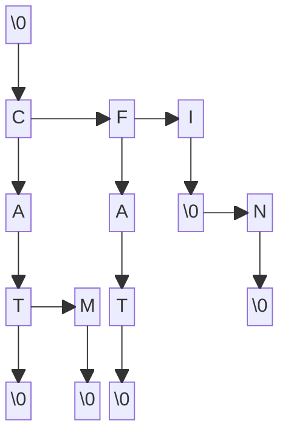

# ------| GUIDE |------
## Graphic representation of a lexical tree :

Current tree store :
- cat
- cam
- fat
- i
- in


## Text editor / corrector :
**While in text editor :**
Writes words and program will suggests k words similar to written word from a given dictionary.
`→` : move cursor to right
`←` : move cursor to left
`Tab` : loop through suggested words
`Esc` : leave editor and create file

**While in text corrector :**
Searches for words in a text that do not exist in the given dictionary. Return the corrected text in a .cor file.
`→` : skip current word and add it to dictionary
`↑` : move suggested words cursor up
`↓` : move suggested words cursor down
`Tab` : loop through suggested words
`Esc` : leave editor and create file


# ------| README 1 |------
## Course 1 (27-03) :
```c++
Added method :
- Noeud::Noeud()
- Noeud::Noeud(char letter)
- Noeud::~Noeud()
- Noeud::operator==(char letter)
- Noeud::operator!=(char letter)
- Noeud::operator<(char letter)
- Noeud::operator>(char letter)
- Noeud::display()
- Noeud::addInFils(char letter)
- Arbre::Arbre()
- Arbre::~Arbre()
- Arbre::addWord(string word)

Started method :
- Noeud::displayAll()
- Arbre::display()
```

## Between the two courses :
```c++
Added method :
- Noeud::displayAll()
- Arbre::display()
- Tab::Tab(int nbr)
- Tab::~Tab()
- Tab::display()

Started method :
- Tab::addWordWithBuffer(string * buffer)
```

## Course 2 (02-04) :
```c++
Added method :
- Tab::addWordWithBuffer(string * buffer)
- Tab::greaterThan(int index1, int index2)
- Tab::sort()
- Tab::search()
- Arbre::Arbre(string file_name)

Started method :
- Noeud::operator=(Noeud & node)
```

## Between the two courses :
```c++
Added method :
- Noeud::operator=(Noeud & node)
- Noeud::displayDirectFils()
- Noeud::nbrDirectFils()
- Noeud::nbrOfWord()
- Noeud::maxLenght()
- Noeud::writeIn(ofstream &flow, string word)
- Arbre::Arbre(Arbre &tree)
- Arbre::searchWord(string word)
- Arbre::nbrOfWord()
- Arbre::maxLenght()
- Arbre::writeIn(string file_name)

Started method :
- Arbre::removeWord(string word)
- Noeud::removeWord(string word)
```

## Course 3 (10-04) :
```c++
Continued method :
- Arbre::removeWord(string word)
- Arbre::removeWord(string word)
```


# ------| README 2 |------
## Course 4 (17-04) :
```c++
Added method :
- Noeud::removeWord(string word)
- Arbre::removeWord(string word)

Started method :
- Noeud::wordWithPrefix(string prefix)
- Arbre::wordWithPrefix(string prefix)
```

## Between the two courses :
```c++
Added method :
- Noeud::wordWithPrefix(string prefix)
- Noeud::insertFilsInVector(vector<string> * vect, string word)
- Arbre::wordWithPrefix(vector<string> * vect, string prefix)
- Arbre::addWordWithText(vector<char> text)
- levenshteinAlgorithm(string str1, string str2)
- writeTextInFile(string file_name, vector<char> text)
- writeTextInTerminal(string file_name, string dic_name)
- displayWords(Arbre * tree, vector<char> text)
```

## Course 5 (30-04) :
```c++
- makefile modified
- reflexion about exercice 14
```


# ------| README 3 |------
## Between the two courses :
```c++
- makefile modified
- fix display issues
- reflexion about exercice 14
```

## Course 6 (05-04) :
```c++
Started method :
- Noeud::listSimilarWord(vector<int> * vect, string word, vector<int> array)
- Arbre::listSimilarWord(vector<string> * vect, string word, int max_dist)

reflexion about exercie 14
```

## Between the two courses :
```c++
Added method :
- Noeud::listSimilarWord(vector<int> * vect, string word, vector<int> array)
- Arbre::listSimilarWord(vector<string> * vect, string word, int max_dist)
- void writeTextInFile(string file_name, vector<string> text)
- getLastWord(vector<char> text)

Started method :
- correctText(string file_name, string dic_name)

Fix of old issues
listSimilarWord method optimised
```


# ------| README 4 |------
## Between the two courses :
```c++
Added method :
- blabla

Started method :
- blabla

Comments added in all the code
README modified
```