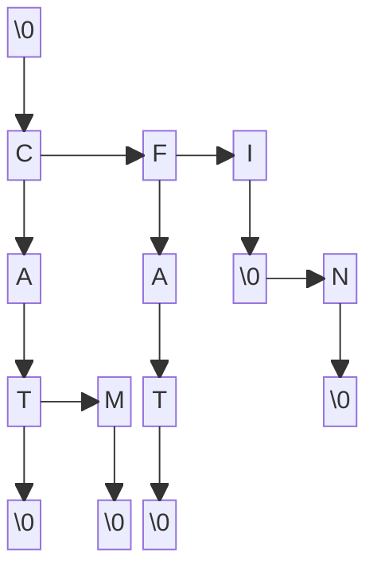

# ----------| GUIDE |----------
## Files :
I added the files from the first subject related to dynamic tables to the `Table` folder. The methods related to lexical trees are in `arbre.cpp` and `arbre.h`. The methods related to the terminal are in `interaction.cpp` and `interaction.h`. A 19k ish word dictionary is provided in `dic-moyen.txt`. Type `make` to compile and run code and `make clean` to clean workspace.
```
Projet/
├── Table/
│   ├── main.cpp
│   ├── table.cpp
│   └── table.h
│
├── arbre.cpp
├── arbre.h
│
├── dic-moyen.txt
│
├── interaction.cpp
├── interaction.h
│
├── main.cpp
│
├── makefile
└── README.md
```


## Graphical representation of a lexical tree :

Words that this tree store :
- cat
- cam
- fat
- i
- in


## Text editor / corrector :
> [!TIP]
> You need to change manually into the code the value for k and max_dist

**While in text editor :**
You can write text into a ncurses terminal and save it into a file.
The program will suggest k words similar to written word from a given dictionary.
- `→` : move cursor to right
- `←` : move cursor to left
- `Tab` : cycle through suggested words
- `Esc` : leave editor and save file

**While in text corrector :**
Searches for words in a text that do not exist in the given dictionary. Save the corrected text in a .cor file.
- `→` : jump to the next incorrect word and leave the corrector upon reaching the end
- `←` : jump to the previous incorrect word
- `Space` : show suggested words 
- `Tab` : cycle through suggested words
- `1-9` : choose among suggested words
- `Esc` : leave the editor and create the .cor file


# ---------| README 1 |---------
## Course 1 (27-03) :
```c++
//Added methods :
- Noeud::Noeud()
- Noeud::Noeud(char letter)
- Noeud::~Noeud()
- Noeud::operator==(char letter)
- Noeud::operator!=(char letter)
- Noeud::operator<(char letter)
- Noeud::operator>(char letter)
- Noeud::display()
- Noeud::addInFils(char letter)
- Arbre::Arbre()
- Arbre::~Arbre()
- Arbre::addWord(string word)

//Started methods :
- Noeud::displayAll()
- Arbre::display()
```

## Between course 1 and 2 :
```c++
//Added methods :
- Noeud::displayAll()
- Arbre::display()
- Tab::Tab(int nbr)
- Tab::~Tab()
- Tab::display()

//Started methods :
- Tab::addWordWithBuffer(string * buffer)
```

## Course 2 (02-04) :
```c++
//Added methods :
- Tab::addWordWithBuffer(string * buffer)
- Tab::greaterThan(int index1, int index2)
- Tab::sort()
- Tab::search()
- Arbre::Arbre(string file_name)

//Started methods :
- Noeud::operator=(Noeud & node)
```

## Between course 2 and 3 :
```c++
//Added methods :
- Noeud::operator=(Noeud & node)
- Noeud::displayDirectFils()
- Noeud::nbrDirectFils()
- Noeud::nbrOfWord()
- Noeud::maxLength()
- Noeud::writeIn(ofstream &flow, string word)
- Arbre::Arbre(Arbre &tree)
- Arbre::searchWord(string word)
- Arbre::nbrOfWord()
- Arbre::maxLength()
- Arbre::writeIn(string file_name)

//Started methods :
- Arbre::removeWord(string word)
- Noeud::removeWord(string word)
```

## Course 3 (10-04) :
```c++
//Continued methods :
- Arbre::removeWord(string word)
- Arbre::removeWord(string word)
```


# ---------| README 2 |---------
## Course 4 (17-04) :
```c++
//Added methods :
- Noeud::removeWord(string word)
- Arbre::removeWord(string word)

//Started methods :
- Noeud::wordWithPrefix(string prefix)
- Arbre::wordWithPrefix(string prefix)
```

## Between course 4 and 5 :
```c++
//Added methods :
- Noeud::wordWithPrefix(string prefix)
- Noeud::insertFilsInVector(vector<string> * vect, string word)
- Arbre::wordWithPrefix(vector<string> * vect, string prefix)
- Arbre::addWordWithText(vector<char> text)
- levenshteinAlgorithm(string str1, string str2)
- writeTextInFile(string file_name, vector<char> text)
- writeTextInTerminal(string file_name, string dic_name)
- displayWords(Arbre * tree, vector<char> text)
```

## Course 5 (30-04) :
```c++
//makefile modified
//reflexion about exercise 14
```


# ---------| README 3 |---------
## Between course 5 and 6 :
```c++
//makefile modified
//fix display issues
//reflexion about exercise 14
```

## Course 6 (05-04) :
```c++
//Started methods :
- Noeud::listSimilarWord(vector<int> * vect, string word, vector<int> array)
- Arbre::listSimilarWord(vector<string> * vect, string word, int max_dist)

//reflexion about exercie 14
```

## Before the end :
```c++
//Added methods :
- Noeud::listSimilarWord(vector<int> * vect, string word, vector<int> array)
- Arbre::listSimilarWord(vector<string> * vect, string word, int max_dist)
- void writeTextInFile(string file_name, vector<string> text)
- editText(string file_name, string dic_name)
- getLastWord(vector<char> text)
- displayWords(Arbre * tree, string last_word, int * start, int k, int max_dist)

//Started methods :
- correctText(string file_name, string dic_name)

//Fix of old issues
//listSimilarWord methods optimised
```


# ---------| README 4 |---------
## Before the end :
```c++
//Added methods :
- correctText(string file_name, string dic_name)

//comments added in all the code
//all exercises done
//README improved
```