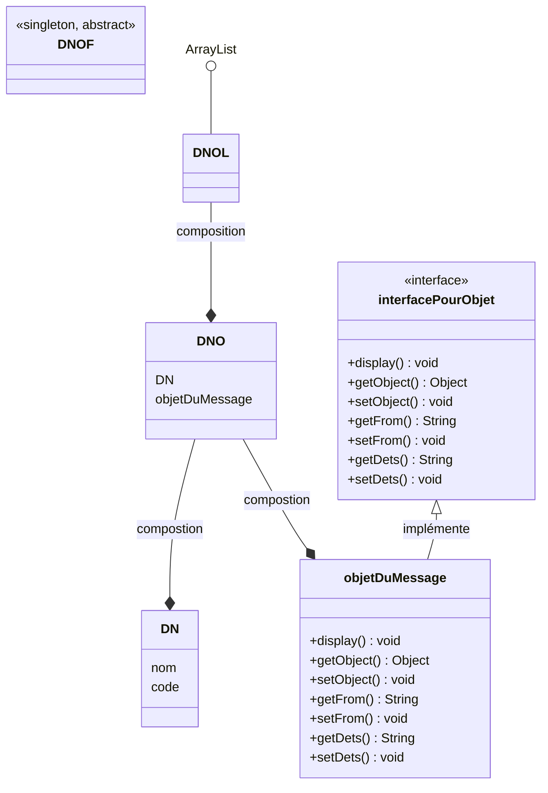

javaDoc en fr
génération du code à partir de quoi ?

https://mermaid.js.org/syntax/classDiagram.html

```mermaid
classDiagram

%% + Public
%% - Private
%%  # Protected
%%  ~ Package/Internal

DNO --* DN : compostion
DNO --* objetDuMessage : compostion
interfacePourObjet <|-- objetDuMessage: implémente
ArrayList ()-- DNOL
DNOL --* DNO : composition

class interfacePourObjet {
    <<interface>>
    +display() void
    +getObject() Object
    +setObject() void
    +getFrom() String
    +setFrom() void
    +getDets() String
    +setDets() void
}

class DNO {
    DN
    objetDuMessage
}

class DN {
    nom
    code
}

class objetDuMessage {
    +display() void
    +getObject() Object
    +setObject() void
    +getFrom() String
    +setFrom() void
    +getDets() String
    +setDets() void
}

class DNOF {
    <<singleton, abstract>>
}

class DNOL

```
